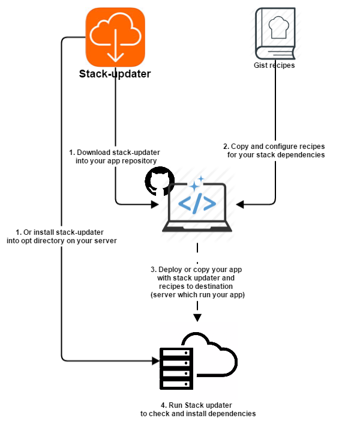

[](https://github.com/igrigorik/ga-beacon)
[](https://codeclimate.com/github/levabd/stack-updater)

# What is it?
Stack updater check dependencies and updates your app stack in a simplest way. 
This is DevOps tool for lazy programmers. Only json and bash file configure you needs.
This application allows you to deploy you projects and not worry about breaking your project due to outdated package on server.

# Table of contents
- [Goals](#goals)
- [How does it work?](#how-does-it-work)
- [Why not Puppet or Chef or etc?](#why-not)
- [Getting started](#start)
  - [Dependencies](#dependencies)
  - [Configuration](#configuration)
  - [Case study](#case-study)
  - [Running the application](#running)
  - [Command line options](#cli-options)
  - [Install recipes from Gist](#install-recipes)
  - [Save as system command](#save-systemd-command)
  - [Logging](#logging)
- [Native and Third party recipes](#cookbook)
- [Customizing](#customizing)
- [Contributing](#contributing)
- [Recipes and log filesystem](#filesystem)
- [License](#license)

# <a name="goals"></a> Goals
Sometimes your app doesn't work after deploying it on server. You worked hard to debug your code but it turned out that the problem was in an obsolete software on the server.
Crap!!!

Sounds Familiar?

That`s why my main criteria:
 * To make package dependencies checking easier.
 * To provide an easy package installation tool when it's necessary.
 * Being simple and scalable.

# <a name="how-does-it-work"></a> How does it work?

When you are called ```python ./updater check```, the script does following:
* Read all json recipes from ```recipes``` folder. 
* Then execute ```command``` prop value from json object (example ```/usr/bin/php -r 'echo phpversion();'```). Command must return version number of package or module (nothing more!!!).
* Then this value is compared with ```required``` prop value and return result.

Also, if you call ```python ./updater install```, after checking, script will try to execute ```installer``` filename from ```recipes``` subdirectory with the same name as recipe filename.

# <a name="why-not"></a> Why not Puppet, Chef, SaltStack or Ansible?

I've been asked why just not simply use Puppet, Chef, SaltStack or Ansible? That tools are perfect. 
I've used Puppet and Chef in the past, it does everything you want it to do, that's a given.
But all of these products are required a lot of DevOps's knowledge and use *master-agent model*. 

I'm just a programmer!
Sometimes I want simply write rules or *recipes* to check dependencies and install package from "Googling Stackoverflow" (write simple bash files).
Stack updater aims to be as simple as possible by providing simple recipes and Github Gist add-on system.

Also I love Python and it's installed out the box on most linux distributions ;)

# <a name="start"></a>Getting started
## <a name="dependencies"></a> Dependencies
* Python (version 2.7 and above)

## <a name="configuration"></a> Configuration

* [Install](#install-recipes) or [create](#customizing) recipes on developer machine
* Copy stack updater with recipe directory to destination machine (server for example)
* configure your deploy or provision process to run this script
 
**If dependencies check failed stack updater exit with ```code 1```**

## <a name="case-study"></a> Case study

* Vagrant init scrips (after ```vagrant up``` or ```vagrant provision```)
* Update software on server before deploy in [Capistrano](http://capistranorb.com/)

## <a name="running"></a> Running the application
```python ./updater [-h] {get,install,check} [gist_id]```

## <a name="cli-options"></a> Command line options

Command line option |     Params     | Description
------------------- | -------------- | ------------------------
check               |                | Check application dependencies
install             |                | Trying to install newer package version if needed (by checking)
get                 | Github Gist id | Download new recipe from Gist
--verbose(-v)       |                | With this flag you can see on the display(not in the log file) triggered command output 
--help(-h)          |                | Command line usage

## <a name="install-recipes"></a> Install recipes from [Gist](https://gist.github.com/discover)

 _Not recommended on production!!!_
 
 If the recipe is in a gist file, you can use the following command ```python ./updater get GIST_ID```, and it will copy all the files in needed place. Be sure to check out the gist's README to see if you need to do any extra configuration.

## <a name="save-systemd-command"></a> Save as system command
Try to create symlink to executable file 
Execute from script directory

Note: Script created for all type of OS, but this instructions only for Debian-like system. Such as:
* Ubuntu, Xubuntu, Kubuntu
* Debian
* Linux Mint
* etc

```sh
chmod u+x updater
sudo ln -s updater /usr/bin
```

## <a name="logging"></a> Logging

Log files are in ```log``` directory. Current log in ```updater.log``` file. Note that you can`t see triggered command output (they are all in log file), only script output.
 
# <a name="cookbook"></a> Native and Third party recipes

This is a list of user submitted Stack updater recipes you can see in wiki [Cookbook](https://github.com/levabd/stack-updater/wiki/Cookbook). 

# <a name="customizing"></a> Customizing

Stack updater can be extensively configured via the recipes in folder recipes.
 * Add new json file like ```recipes/recipe.json.example```. Filename is not important. Only ```json``` ending
 * Add bash executable for package installation if needed and put it in folder with same name as recipe. 
 * Comparison rules are simple, but if you want to customize them, see ```app/helpers/version.py```
 
# <a name="contributing"></a> Contributing
 
 All contributions are more than welcome; [especially new recipes](#recipes)!
 
 The easiest way to share a recipe is to create a gist with the required files. Be sure to include a README with some instructions on how to use it.
 
 The [Laravel 5.2](https://gist.github.com/levabd/13c3213830cecacbd347) recipe is a great example.
 
 When you're ready, add your widget, a package list for it and supported Linux distro to the table above. Please keep the list in alphabetical order.

# <a name="filesystem"></a> Recipes and log filesystem

```python
.
├── updater #entry point
├── recipes
│    ├── recipe.json
│    ├── recipe #same name as recipe linked for
│    │    ├── bash_installer.sh #executable packet installer
│    │    ├── another_bash_installer.sh
│    │    └── ...
│    ├── another_recipe.json
│    └── ...
├── log
│    ├── updater.log #current log
│    ├── updater.log.2016-03-09_21-48-51 # for example
│    └── ...
├── stackupdater #app folder
├── docs #for auto-generated HTML documentation ([Sphinx](http://www.sphinx-doc.org/), [ReadTheDocs](https://readthedocs.org/))
├── resources #any additional files
└── ...
```

# <a name="license"></a> License
Distributed under the [MIT license](LICENSE)
